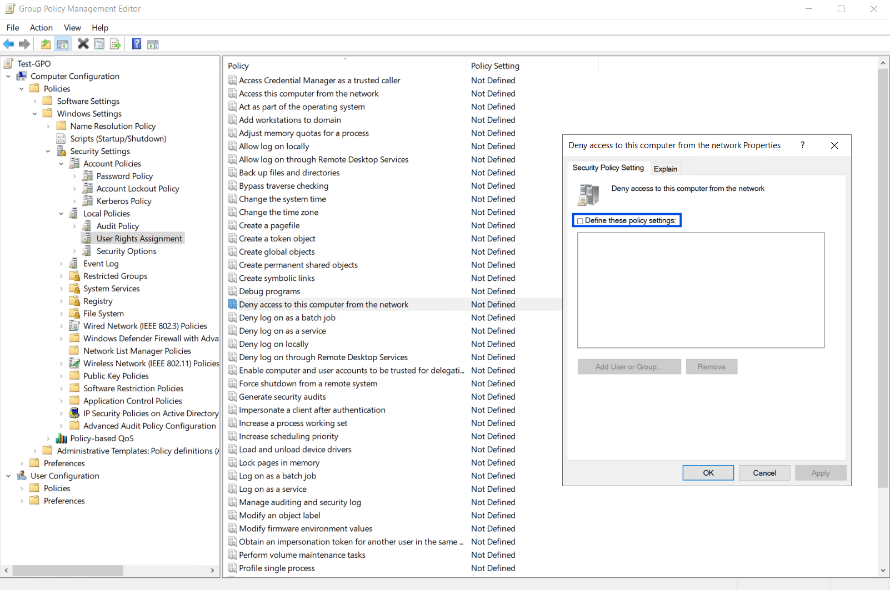

# Symptoms
During deployment, update, or add-node you may encounter 'Access Denied'. Some examples include:

During deployment you might see the following error message(s)

```
Exception: Connecting to remote server <hostname/IP> failed with the following error message: Access is denied
```

```
Exception : Type 'ValidateConnectivity' of Role 'EnvironmentValidator' raised an exception: Unable to create a valid session to <ip>: [<ip>] 
Connecting to remote server <ip> failed with the following error message : Access is denied. 
```

During update download stage, you may see:

```
update package download failure with details similar to "Action plan GetCauDeviceInfo ID xxx failed with state: Failed".
```

During any action plan, if you see the following, go to "Known Causes" #6
```
Connecting to remote server <ClusterName> failed with the following error message : An unknown security error occured
```
# Known Causes
1. The LCM (deployment user) credentials were not updated properly using the [Set-AzureStackLCMUserPassword](https://learn.microsoft.com/en-us/azure/azure-local/manage/manage-secrets-rotation?view=azloc-24112#run-set-azurestacklcmuserpassword-cmdlet) cmdlet. This cmdlet is responsible for updating the password in Active Directory as well as updating it in the ECE Store. Both of these should be in sync, otherwise there will be access denied issues.
2. The LCM user does not have sufficient permissions on the Organization Unit (OU) in Active Directory (AD).
3. The NTLM policy, configured via Group Policy, may be blocking remote operations such as Invoke-Command. This can occur if NTLM is restricted either at the OU level or on the individual nodes or the domain controller via applied Group Policy Objects (GPOs).
4. The WinRM trusted hosts configuration is set up incorrectly.
5. The LCM user is part of the "Protected Users" group (See Protected Users heading below).
6. Cluster's SPN is misconfigured (See Unknown Security Error heading below)

# Issue Validation

Before running the following steps, please log into a node with the LCM user credential to ensure the credential works. If you do not know your LCM username, please view the [Retrieving your LCM (user deployment) username section](#retrieving-your-lcm-deployment-user-username). If you do not know your LCM user credentials, then you will need to recreate the LCM user and follow this document to ensure the LCM user is set up properly.

### Step 1: Check if LCM user is in the Local Administrators Group on all cluster nodes
Run the script below on all cluster nodes. Replace the `$lcmUser` variable with your LCM (deployment) user, and fill in `$groupsContainingLCMUser` if not logged in as lcmUser. 

```Powershell
# Set your LCM user
$lcmUser = 'DOMAIN\LCMUser'
# If logged in as LCMUser, run script at this point. Otherwise go to next comment
$groupsContainingLCMUser = (whoami /groups) |
    Select-Object -Skip 6 |
    ForEach-Object {
        ($_ -split '\s{2,}')[0]
    } |
    Where-Object { $_ -and $_ -ne "===" }

# If not logged in as lcmUser, manually populate groups lcmUser belongs to, and uncomment below
<#$groupsContainingLCMUser = @(
    'DOMAIN\Group1',
    'DOMAIN\Group2',
    'DOMAIN\Group3'
)#>

Write-Output "Checking if the LCM user or any of the specified groups are in the local Administrators group..."

try {
    $adminGroupMembers = Get-LocalGroupMember -Group 'Administrators'
} catch {
    Write-Error "Failed to retrieve Administrators group members. Error: $_"
    return
}

$found = $false

# Check if any of the groups are in the Administrators group
foreach ($group in $groupsContainingLCMUser) {
    if ($adminGroupMembers.Name -contains $group) {
        Write-Output "Group '$group' is in the Administrators group."
        $found = $true
    }
}

# Check if LCM user is directly in the Administrators group
if ($adminGroupMembers.Name -contains $lcmUser) {
    Write-Output "User '$lcmUser' is directly in the Administrators group."
    $found = $true
}

if ($found) {
    Write-Output "$lcmUser has administrative rights either directly or via one of the specified groups."
} else {
    Write-Output "$lcmUser does NOT have administrative rights via the specified groups or directly."
}
```

If the script shows that the `lcmUser` is not in the local Administrators group, then run the mitigation below:

```Powershell
# Replace 'DOMAIN\LCMUser' with your actual LCM username
$lcmUser = 'DOMAIN\LCMUser'

Write-Output "Attempting to add $lcmUser to the local Administrators group..."
try {
    Add-LocalGroupMember -Group 'Administrators' -Member $lcmUser
    Write-Output "$lcmUser was successfully added to the local Administrators group."
} catch {
    Write-Error "Failed to add $lcmUser to the Administrators group. Error: $_"
}
```

### Step 2: Check the LCM user credentials work on all nodes
Verify the LCM user credentials work with all iterations of Invoke-Command with and without CredSSP and using the hostname or the IP as the target:

```PowerShell
$credential = Get-Credential # Input your LCM (deployment user) credentials

$targetHostname = "<target_hostname>" # Replace with your target host
$targetIp = "<target_ip>" # Replace with your target IP address

Invoke-Command -computername $targetHostname -credential $credential -scriptblock {hostname}
Invoke-Command -ComputerName $targetHostname -Credential $credential -Authentication Credssp -ScriptBlock {whoami}

Invoke-Command -computername $targetIp -credential $credential -scriptblock {hostname}
Invoke-Command -ComputerName $targetIp -Credential $credential -Authentication Credssp -ScriptBlock {whoami}
```

If there are no issues running the previous script, then proceed to **Step 3**, otherwise:

1. If no Invoke-Command works (with or without CredSSP), double check you have entered the right LCM user credentials. If you are certain they are correct, then check the [WinRM Trusted Hosts configuration](#winrm-trusted-hosts-configuration) is set up properly to include all hostnames, FQDNs and IPs of all nodes in your cluster.
2. If Invoke-Command without CredSSP works, but CredSSP does not work, please review the [CredSsp-Authentication-Issues Doc](../Security/CredSsp-Authentication-Issues.md).
3. If Invoke-Command with hostname works, but using the IP does not work, ensure the [WinRM Trusted Hosts configuration](#winrm-trusted-hosts-configuration) is set up properly to include all IPs of all nodes in your cluster and that a Group Policy Object (GPO) [is not blocking NTLM](#check-ntlm-is-not-blocked-by-gpo).
 
### Step 3: Verify the LCM credential in AD matches ECE Store
If Invoke-Command works, then validate the credential exists in ECE store by running the script in the [Validating LCM (user deployment) credentials match the ECE Store](#validating-lcm-user-deployment-credentials-match-the-ece-store) section. If this script returns that they do not match, run the mitigation script from the same section.

### Step 4: Check LCM user permissions on the OU
Verify the Active Directory permissions are set properly for the LCM user. Log into the domain controller node using the LCM user credentials and run the following to get the Access Control List (ACL) for the user on the OU. Replace the LCM username in the script with your LCM username and the sample OU with your environment OU. You can get the OU by running `Get-ADOrganizationalUnit -Filter *` on the domain controller (DC) node. You should also check the permissions of any groups that the LCM user belongs to, since they are inherited by the LCM user.

```Powershell
# Define the target OU (update to match your environment)
$ou = "OU=MyOU,DC=domain,DC=com"

# Get the ACL of the OU
$acl = Get-Acl "AD:$ou"

# Define the LCM username (without domain prefix)
$lcmUsername = "<lcm_username>"

# Get the domain name in short form
$domain = (Get-WmiObject -Class Win32_ComputerSystem).Domain
$shortDomain = $domain.Split('.')[0]
$user = "$shortDomain\$lcmUsername"

$userAcl = $acl.Access | Where-Object { $_.IdentityReference -like "*$user*" }
$userAcl | Select-Object IdentityReference, ActiveDirectoryRights, AccessControlType
```

You should see output like the following:
```
IdentityReference           ActiveDirectoryRights AccessControlType
-----------------           --------------------- -----------------
<domain>\<LCM Username>              ReadProperty             Allow
<domain>\<LCM Username>                GenericAll             Allow
<domain>\<LCM Username>  CreateChild, DeleteChild             Allow
```

The user should have the following permissions on the OU:
* ReadProperty 
* GenericAll 
* CreateChild 
* DeleteChild 
 
If you do not see all of these ActiveDirectoryRights listed for this user, please follow [instructions to prepare active directory](https://learn.microsoft.com/en-us/azure/azure-local/deploy/deployment-prep-active-directory?view=azloc-2503), including running the `AsHciADArtifactsPreCreationTool` listed in the wiki to ensure all permissions are set appropriately for the user. Ensure these same permissions are applied to all OU objects and their descendents.

### WinRM TrustedHosts Configuration
TrustedHosts should be checked on each node for correct configuration.
```Powershell
Get-Item WSMan:\localhost\Client\TrustedHosts
```

TrustedHosts should include the following:
- Each cluster node's hostname
- Each cluster node's IP address
- Each cluster node's FQDN

To set TrustedHosts, use one of the commands below and replace the placeholder values with your cluster node hostnames, IPs, and FQDNs.

```PowerShell
# Setting and overwriting all values
Set-Item WSMan:\localhost\Client\TrustedHosts -Value "hostname1,hostname2,192.168.0.1,192.168.0.2,hostname1.contoso.local,hostname2.contoso.local" -Force
```
```PowerShell
# Adding missing values to existing TrustedHosts
Set-Item WSMan:\localhost\Client\TrustedHosts -Value "hostname1.contoso.local,hostname2.contoso.local" -Concatenate -Force
```

# Scripts
### Validating LCM (User Deployment) Credentials Match the ECE Store

NOTE: Please note that the LCM Username should be provided without domain and not contain any special characters. To Validate that the username provided is of the correct format, run:

```Powershell

if ($credential.UserName -match '^[^\\]+(?=\\)|(?<=@).+$') {
    throw "Please provide user name without domain."
}
```
Proceed with credential validation:

#### NOTE: Please run the below 'CredentialsHelper' from the seed node. 
#### To find the seed node :

```Powershell
$owner_node = (Get-ClusterResource *Orc*).OwnerNode.Name
$owner_node
```

```Powershell

function CredentialsHelper
{
[CmdletBinding(DefaultParameterSetName = 'VerifyCredential')]
    param (
        [Parameter(Mandatory, ParameterSetName = 'WithCredential')]
        [pscredential]
        $Credential,

        [Parameter(Mandatory, ParameterSetName = 'FetchLCMUserName')]
        [switch]
        $FetchUsername
    )

    try
        {
        # Retrieve the latest ECEWinService NuGet Version
        $eceWinService = Get-ChildItem "C:\Agents" -Directory |
            Where-Object { $_.Name -match 'Microsoft\.AzureStack\.Solution\.ECEWinService\.(\d+\.\d+\.\d+\.\d+)' } |
            ForEach-Object {
                [PSCustomObject]@{
                    Path = $_.FullName
                    Version = [version]$matches[1]
                }
            } |
            Sort-Object Version -Descending |
            Select-Object -First 1

        $eceWinServiceVersion = $eceWinService.Version.ToString()
        $eceWinServicePath = $eceWinService.Path

        # Load Assemblies
        [System.Reflection.Assembly]::LoadFile("$eceWinServicePath\content\ECEWinService\CloudEngine.dll") | Out-Null
        [System.Reflection.Assembly]::LoadFile("$eceWinServicePath\content\ECEWinService\Microsoft.AzureStack.Orchestration.Common.Packaging.Contract.dll") | Out-Null
        [System.Reflection.Assembly]::LoadFile("$eceWinServicePath\content\ECEWinService\Microsoft.AzureStack.Orchestration.Common.Packaging.dll") | Out-Null
        [System.Reflection.Assembly]::LoadFile("$eceWinServicePath\content\ECEWinService\Microsoft.Diagnostics.Tracing.EventSource.dll") | Out-Null

        # Load MetricTelemetry.dll if it exists, otherwise fallback to Telemetry.dll
        $metricTelemetryPath = "$eceWinServicePath\content\ECEWinService\Microsoft.AzureStack.Solution.MetricTelemetry.dll"
        $telemetryPath = "$eceWinServicePath\content\ECEWinService\Microsoft.AzureStack.Solution.Telemetry.dll"

        if (Test-Path $metricTelemetryPath) {
            [System.Reflection.Assembly]::LoadFile($metricTelemetryPath) | Out-Null
        } elseif (Test-Path $telemetryPath) {
            [System.Reflection.Assembly]::LoadFile($telemetryPath) | Out-Null
        } else {
            Write-Warning "Neither MetricTelemetry.dll nor Telemetry.dll found in $eceWinServicePath"
        }

        #Retrieve LCM User Username
        Import-Module ECEClient 3>$null 4>$null
        $eceClient = Create-ECEClusterServiceClient
        $cloudDefinitionAsXmlString = (Get-CloudDefinition -EceClient $eceClient).CloudDefinitionAsXmlString
        $cloudDefElements = [System.Xml.Linq.XElement]::Parse($cloudDefinitionAsXmlString)
 
        $customerConfigurationObject = New-Object -TypeName 'CloudEngine.Configurations.CustomerConfiguration' -ArgumentList $cloudDefElements
        $cloudRoleObject = [CloudEngine.Configurations.ConfigurationPathExtensions]::Find($customerConfigurationObject, 'Cloud')
        [CloudEngine.Configurations.IInterface] $interface = $cloudRoleObject.Interface('Build')
        $eceParams = $interface.GetInterfaceParameters()
 
        $securityInfo = $ECEParams.Roles["Cloud"].PublicConfiguration.PublicInfo.SecurityInfo
        $DAdmin = $securityInfo.DomainUsers.User | Where Role -eq "DomainAdmin"

        $DAAdminUserCredential = $ECEParams.GetCredential($DAdmin.Credential) 

        if ($FetchUsername)
        {
            Write-AzsSecurityVerbose "Your LCM username is: $($DAAdminUserCredential.UserName)" -Verbose
            return
        }

        $DAAdminUserPassword = $DAAdminUserCredential.GetNetworkCredential().password

        $userProvidedPassword = $Credential.GetNetworkCredential().Password
        $userProvidedUserName = $Credential.GetNetworkCredential().UserName

        if ($DAAdminUserCredential.UserName -ne $userProvidedUserName)
        {
            Write-AzsSecurityWarning -Message "Provided LCM credential user name does not match the one in ECE." -Verbose
        }

        if ($DAAdminUserPassword -eq $userProvidedPassword)
        {
            Write-AzsSecurityVerbose -Message "Found matching credentials in ECE store." -Verbose
        }
        else
        {
            Write-AzsSecurityWarning -Message "Could not find matching credentials in ECE store. Please proceed with mitigation to update LCM user password in ECE." -Verbose
        }
        }
        catch
        {
            Write-AzsSecurityWarning -Message "There was an issue verifying credentials. Error $_. Please reach out to Microsoft support for help" -Verbose
        }
}

$lcmCredentials = Get-Credential
CredentialsHelper -Credential $lcmCredentials
```

### Mitigation
Please input your LCM user credentials when prompted. **DO NOT include the domain as part of the username in the credential**.

```PowerShell
# Prompt for credentials
$credential = Get-Credential

# Validate credentials
try {
    # Attempt to invoke a simple command (Get-Process) on the local machine to validate credentials
    Invoke-Command -ScriptBlock { whoami } -Credential $credential -ErrorAction Stop -ComputerName localhost

    Write-Host "Credential validation successful." -ForegroundColor Green
}
catch {
    Write-Host "Credential validation failed. Please check the username and password." -ForegroundColor Red
    return
}

# Import the necessary module
Import-Module "C:\Program Files\WindowsPowerShell\Modules\Microsoft.AS.Infra.Security.SecretRotation\PasswordUtilities.psm1" -DisableNameChecking

# Print the User Name
Write-Host "Username provided: $($credential.UserName)" -ForegroundColor Cyan

# Validate that the username provided is of the correct format. Username should be provided without domain and not contain any special characters.
if($credential.UserName -match '^[^\\]+(?=\\)|(?<=@).+$')
{
    throw "Please provide user name without domain."
}

# Check the status of the ECE cluster group
$eceClusterGroup = Get-ClusterGroup | Where-Object { $_.Name -eq "Azure Stack HCI Orchestrator Service Cluster Group" }
if ($eceClusterGroup.State -ne "Online") {
    Write-AzsSecurityError -Message "ECE cluster group is not in an Online state. Cannot continue with password rotation." -ErrRecord $_
}

# Update ECE with the new password
Write-AzsSecurityVerbose -Message "Updating password in ECE" -Verbose

$ECEContainersToUpdate = @(
    "DomainAdmin",
    "DeploymentDomainAdmin",
    "CloudAdmin"
)

foreach ($containerName in $ECEContainersToUpdate) {
    Set-ECEServiceSecret -ContainerName $containerName -Credential $credential 3>$null 4>$null
}

Write-AzsSecurityVerbose -Message "Finished updating credentials in ECE." -Verbose
```
### Retrieving Your LCM (deployment user) Username
Run the following script on your HCI node to retrieve the LCM username:

NOTE: Please copy and run the 'CredentialsHelper' from the above "Validating LCM (User Deployment) Credentials Match the ECE Store" section.

```Powershell
CredentialsHelper -FetchUsername
```

### Check NTLM is not Blocked by GPO
Verify that you do not have policies in your domain controller that are restricting NTLM access. Please review [Network security: Restrict NTLM: NTLM authentication in this domain](https://learn.microsoft.com/en-us/previous-versions/windows/it-pro/windows-10/security/threat-protection/security-policy-settings/network-security-restrict-ntlm-ntlm-authentication-in-this-domain).

## Access Denied because LCM is part of "Protected User" Group
### Symptoms
Deployment fails with `access denied` when doing invoke-command or new-pssession from node1 -> node1

The following variations of invoke-command or new-pssession from node1 -> node1 fail
- new-pssession \<node1 hostname\>
- new-pssession localhost
- new-pssession \<loopback IP\>

The following variations of invoke-command or new-pssession succeed
- new-pssession \<node1 hostname\> -EnableNetworkAccess
- new-pssession \<node1 hostname.fqdn>
- new-pssession \<node2 hostname\>

### Issue Validation
#### Validation Step 1
Repro the issue by running the following from node1:
```Powershell
new-pssession <node1 hostname>
$event = Get-WinEvent -LogName Security -FilterXPath "*[System[(EventID=4625)]]" | Select-Object -First 1
$event.message
```
If you see the following error code in the message, this is an indication of the problem
```
Failure Information:

              Failure Reason:                  Unknown user name or bad password.
              Status:                          0xC000006E
              Sub Status:                      0xC000006E
```
#### Validation Step 2
From the DC, run the following:
```Powershell
Get-ADUser -Identity <LCMUser> -Properties MemberOf | Select-Object -ExpandProperty MemberOf # Use LCM username without domain prefix
```
If the output has something similar to `CN="...protectedusers..."` the LCM user is part of the "Protected Users" group. If both validations passed, follow the mitigation below.
### Mitigation
The LCM user must be removed from the "Protected Users" group.


## Invoke-Command fails with with Unknown Security Error
`Note this section applies to errors with Invoke-Command to the <ClusterName> only, not to the <HostName>`
### Symptoms
Invoke-Command from any host node to the \<ClusterName\> fails with:
```
Connecting to remote server <ClusterName> failed with the following error message : An unknown security error occured
```
The issue can be manually repro'd with the following:
```Powershell
Invoke-Command -ComputerName <ClusterName> -Credential <LCMUserCreds> -Authentication Credssp -ScriptBlock { hostname }
```
The following scenarios still work:
- Invoke-Command to \<ClusterName\> without Credssp
- Invoke-Command to \<HostName\> with Credssp
### Issue Validation
From any host node check ClusterName's SPN for WSMAN/\<ClusterName\>
```Powershell
setspn -L <ClusterName>
```
You should see a bunch of entries including `HOST/<Clustername>` and `HOST/<ClusterName>.<FQDN>`

If you see entries for either `wsman/<ClusterName>` or `wsman/<ClusterName>.<FQDN>` follow the mitigation

`Note - this issue is only for the Cluster's SPN. Nodes with SPN's of wsman/<HostName> is expected`
### Mitigation
Remove the entries for `wsman/<ClusterName>` and `wsman/<ClusterName>.<FQDN>`
```Powershell
setspn -D wsman/<ClusterName> <ClusterName>
setspn -D wsman/<ClusterName>.<FQDN> <ClusterName>
```

## Access Denied because remote logon related GPO policy is applied
### Symptoms
#### Symptom 1
Deployment fails with `Access is Denied` during `AddAsZHostToDomain` step, right after node is joined to domain. An example of error message can be:
```
Type 'AddAsZHostToDomain' of Role 'BareMetal' raised an exception: Unable to connect to the <NODE_IP> using .\Administrator credentials. Please check the .\Administrator credentials.
```


#### Symptom 2
When you recently made Group Policy change and applied to Azure Local clusters, your admin account, either local admin or domain account added to node's local `Administrators` group, fails to remotely logon to a node and gets `Access is Denied` error. 

### Issue Validation
Please run the following script on your node through BMC console, or through another user that can still remotely connect (i.e., via PowerShell session or RDP) to the impacted node.

```powershell
$ErrorActionPreference = 'Stop'

# SIDs to check
$Sid_LocalAdminCapability = 'S-1-5-114'
$Sid_AdministratorsGroup  = 'S-1-5-32-544'
$isBlocked = $false

$TempCfg = Join-Path $env:TEMP 'secpol.cfg'

Write-Host "=== Checking SeDenyNetworkLogonRight ==="

# Export effective user rights
secedit /export /areas USER_RIGHTS /cfg $TempCfg | Out-Null

$denyLine = Select-String -Path $TempCfg `
    -Pattern '^SeDenyNetworkLogonRight\s*=' `
    -ErrorAction SilentlyContinue |
    Select-Object -First 1

Remove-Item $TempCfg -Force -ErrorAction SilentlyContinue

if (-not $denyLine) {
    Write-Host "SeDenyNetworkLogonRight: NOT configured"
    Write-Host "Local admins blocked: NO"
}
else {
    Write-Host "SeDenyNetworkLogonRight: CONFIGURED"
    Write-Host "Raw value:"
    Write-Host "  $($denyLine.Line)"

    $assignedSids = (($denyLine.Line -split '=', 2)[1] -split ',') |
        ForEach-Object { $_.Trim().TrimStart('*') }

    Write-Host "Assigned SIDs:"
    foreach ($sid in $assignedSids) {
        Write-Host "  - $sid"
    }

    $blocked114 = $assignedSids -contains $Sid_LocalAdminCapability
    $blocked544 = $assignedSids -contains $Sid_AdministratorsGroup
    $isBlocked = $blocked114 -or $blocked544

    if ($isBlocked) {
        Write-Host "Local admins blocked: YES"
    }
    else {
        Write-Host "Local admins blocked: NO"
    }
}

if ($isBlocked)
{
    Write-Host ""
    Write-Host "=== Identifying applying GPO(s) ==="

    $gpresultText = gpresult /scope computer /Z 2>$null

    $gpos = $gpresultText |
        Select-String 'Policy:\s+DenyNetworkLogonRight' -Context 3,3 |
        ForEach-Object {
            $_.Context.PreContext |
                Select-String 'GPO:' |
                ForEach-Object {
                    ($_ -split 'GPO:\s*')[1].Trim()
                }
        } |
        Select-Object -Unique

    if ($gpos) {
        foreach ($gpo in $gpos) {
            Write-Host "GPO that contains the DenyNetworkLogonRight policy: $gpo"
        }
    }
    else {
        Write-Host "GPO that contains the DenyNetworkLogonRight policy: UNKNOWN (Run gpresult /scope computer /Z manually to confirm, or it may not be applied via Group Policy)"
    }
}
Write-Host "=== Done ==="
```
If you see `Local admins blocked: YES` in the output, that means the issue is validated.

### Mitigation
Here is an example output from the validation script that validated the issue.

```
=== Checking SeDenyNetworkLogonRight ===
SeDenyNetworkLogonRight: CONFIGURED
Raw value:
  SeDenyNetworkLogonRight = *S-1-5-32-544
Assigned SIDs:
  - S-1-5-32-544
Local admins blocked: YES

=== Identifying applying GPO(s) ===
GPO that contains the DenyNetworkLogonRight policy: Test-GPO
=== Done ===
```

Please check the last section and find the GPO name that contains this  `DenyNetworkLogonRight` policy. In Group Policy console it is displayed as `Deny Access to this computer from the network`. Go to the Group Policy management console and find the GPO with that name. Either uncheck the `Define these policy settings` checkbox for this policy, or remove `Administrators` group from the policy value. 

Location where you can find the policy: 


Once finished, run
```powershell
gpupdate /force
```
on each impacted node. This will help mitigate the issue. Once this is done on all impacted nodes, you can then retry the failed action.
